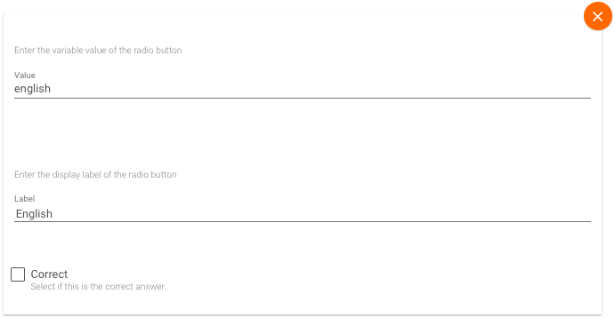
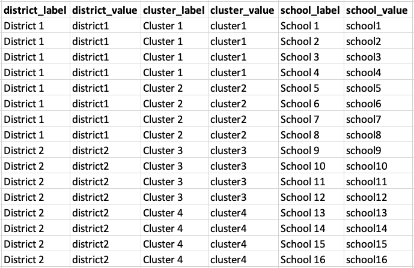

# Tangerine User Manual

By [Rushil Gupta](https://rushilgupta.tech)

---

## Overview

This manual covers basic use cases of Tangerine and how to develop basic assessment tools using it. It also contains simple code snippets for users with limited technical knowledge to implement advanced features.

## Table Of Contents

1. [Creating Simple Forms](#creating-simple-forms)

2. [Downloading Collected Data](#downloading-collected-data)

3. [Randomization of Sections](#randomization-of-sections)

4. [Auto-Stop Timed Grids](#auto-stop-timed-grids)

5. [Auto-Stop Untimed Grids](#auto-stop-untimed-grids)

6. [Last Steps](#last-steps)

<div style="page-break-after: always;"></div>

## Creating Simple Forms

---

To create forms in Tangerine, click the + button in Author > Forms. This part of the manual will go over making sections within these forms and important parts of sections.

### Creating a Section

To create a section, open the form you want to create a section in, and then scroll down and click `+ Add Section`. Now, click the edit option and write the desired section's name.

We will now go over adding important sub-sections, including inputs, lists, location, and specialty.

### Inputs (Text and Number)

There are a total of 5 fields that can be filled, out of which, the following 2 fields are the most important and mean the following:

- `Variable Name`: The variable which contains the input's value (Unique throughout the form)
- `Label`: The question/statement shown above the input field

### Lists (Radio Buttons and Dropdown)

Like the Inputs sub-section, the `Variable Name` and `Label` fields remain the same. To add options within the lists, follow the method below:

- If there is no available option field under the `Options` heading, add one
- In the `Label` field, add the option's name (Visible to users)
- In the `Value` field, add the value that you want to be stored in the variable

A set of options may look like the following: 

<div style="page-break-after: always;"></div>

### Location (Location)

This sub-section is often used to specify nested locations. For example, if you want a user to choose a district, then a cluster, and then a school. For it to work, you must configure Tangerine by going to the Configure > Location List section.

However, an Excel file containing the data must be created before that. In this example, the last layer of the nested locations is schools. Therefore, in the Excel file, you need to have a row for each school and have the following columns:

- `district_label`: The district name visible to the users
- `district_value`: The district value stored in Tangerine
- `cluster_label`: The cluster name visible to the users
- `cluster_value`: The cluster value stored in Tangerine
- `school_label`: The school name visible to the users
- `school_value`: The school value stored in Tangerine

A sample Excel file would look like the following: 

A generalized understanding implies that the `{level_name}_label` and `{level_name}_value` columns need to exist for each level.

#### Configuring Tangerine With The Data

Head to Configure > Location List. Under the `Levels` tab, click the `+` button, write the highest levels' name in the label option, and click `submit`. In this case, the highest level is district, so put `District` in the label field.

Now, for each level after the first level, follow the following steps:

- Click on the `+` button
- Write the level's name in the `label` field
- Select the level's parent level to be the one right before the current one (for example, for cluster, it would be district)

Now, move to the `Import` tab. Click `Import CSV` and import the Excel/CSV file you made. For each level, choose its corresponding label and value columns.

In this case, the `District` level will use the `district_label` and `district_value` columns, the `Cluster` level will use the `cluster_label` and `cluster_value` columns, and so on.

#### Adding the Location Sub-Section

Now, you can finally use the nested levels. To do this, follow the following method:

- Add a `Location` sub-section
- Similar to the Inputs and Lists field, fill the `Variable` and `Label` fields
- In the `Show levels` field, write the names of each level separated by commas. In this example, the field would be filled by `District,Cluster,School`
- Done!

_Note: This is just an example, and you would need to make modifications as per the locations you require_

### Specialty (Timed and Untimed Grids)

The Grids in Tangerine are very useful for many assessment tools. When you add a grid, you need to fill in the following fields:

- `Variable name`: The name of the variable in which the user's performance will be stored
- `Duration (Timed Grid)`: The time in seconds for the grid's assessment (Example: stop after 60 seconds)
- `Options`: All the text that should be displayed in the grid separated by commas (Example: hi,this,is,tangerine)

<div style="page-break-after: always;"></div>

## Downloading Collected Data

---

After creating the tool and using it, the data is stored online on Tangerine. To download this data as a CSV file, go to the `Data` section and click `+ Request Spreadsheets`. Then, choose the form you want to download the data for and click on `Submit Request`. Within a few seconds, you will be able to download a CSV file with the data!

<div style="page-break-after: always;"></div>

## Randomization of Sections

---

### Choose Randomization Type

There are 2 ways to randomize sections: (1) Randomly choose one section from a given set (Example: section 1 out of 30) or (2) Choose a set of sections from a given set of such sets (Example: set 1 out of 4).

### Option 1: Randomly Choosing a Section

Consider a case where there are 5 ORF passages, and you want a student to be given 1 randomly. The sections are named `ORF_1`, `ORF_2`, `ORF_3`, `ORF_4` and `ORF_5`. To implement the required feature, follow the steps below.

(1) Insert the following code into the on-open section:

```javascript
window.chosenSection = null;
```

(2) Insert the following code into the on-change section:

```javascript
const sections = [
  "ORF_1",
  "ORF_2",
  "ORF_3",
  "ORF_4",
  "ORF_5",
];

if (!window.chosenSection) {
  window.chosenSection =
    sections[Math.floor(Math.random() * sections.length)];
}

for (let i = 0; i < sections.length; i++) {
  let section = sections[i];
  if (section == window.chosenSection) {
    sectionEnable(section);
  } else {
    sectionDisable(section);
  }
}
```

_Note: To customize this code for your sections, you do not need to change anything except the_ `sections` _list that you added to the on-change section with your sections_

<div style="page-break-after: always;"></div>

### Option 2: Randomly Choosing a Set of Sections

Consider a case where there are 5 sets of tests, with each set having the following sections:

- `readingTestSet{set}`
- `oralTestSet{set}`
- `listeningTestSet{set}`
- `mathTestSet{set}`

You want to randomly assign each student 1 set when they give the assessment. To implement the required feature, follow the steps below.

Insert the following code into the on-open section:

```javascript
window.chosenSet = null;
```

Insert the following code into the on-change section:

```javascript
const noSets = 5; // Add number of sets you have here

const sectionsInSet = [
  "readingTestSet{set}",
  "oralTestSet{set}",
  "listeningTestSet{set}",
  "mathTestSet{set}",
];

if (!window.chosenSet) {
  window.chosenSet = Math.ceil(
    Math.random() * window.noSets
  );
}

for (let set = 1; set <= noSets; set++) {
  for (let i = 0; i < sectionsInSet.length; i++) {
    let section = sectionsInSet[i].replace("{set}", set);
    if (set == window.chosenSet) {
      sectionEnable(section);
    } else {
      sectionDisable(section);
    }
  }
}
```

_Note: To customize this code for your sections, you need to change the_ `sectionsInSet` _list that you added to the on-change section with a list of the sections in each set and the_ `noSets` _variable with the number of sets in your tool_

<div style="page-break-after: always;"></div>

## Auto-Stop Timed Grids

---

This section goes over implementing an auto-stop feature for timed grids when the user answers incorrectly a certain number of times consecutively.

### Pre-Steps

Click the `Edit HTML` option of Tangerine, and copy the code to any desirable code editor, like VSCode. If you aren't comfortable with code editors, proceed to edit the HTML within the given input box.

_Note: Make sure to save a copy of the HTML file (copy and paste the HTML to a .txt file)_

### Code Snippet

Find the correct `<tangy-timed>` element in the HTML by searching for the variable's name in the HTML until you find the correct `<tangy-timed>` element. Now, insert the following code into the `<tangy-timed>` element you found!

```javascript
onchange="
    if (1 == 1) {
        const buttons = this.shadowRoot.querySelectorAll('tangy-toggle-button');
        let count = 0;
        let threshold = 4; // Number of consecutive words inccorect

        for (let i = 0; i < buttons.length; i++) {
            if (buttons[i].pressed) {
            count++;
            if (count >= threshold) {
                break;
            }
            } else {
            count = 0;
            }
        }

        if (count >= threshold && !this.gridAutoStopped) {
            this.stopGrid();
            this.gridAutoStopped = true;
        }
    }
"
```

_Note: Customize the code by editing the_ `threshold` _variable to set the number of answers incorrect to stop the grid_

<div style="page-break-after: always;"></div>

### Example

Here is an example of what your `<tangy-timed>` element would look like once you have added the code.

```javascript
<tangy-timed
  ... // pre-exsiting code
  onchange="
    if (1 == 1) {
        const buttons = this.shadowRoot.querySelectorAll('tangy-toggle-button');
        let count = 0;
        let threshold = 4; // Number of consecutive words inccorect

        for (let i = 0; i < buttons.length; i++) {
            if (buttons[i].pressed) {
            count++;
            if (count >= threshold) {
                break;
            }
            } else {
            count = 0;
            }
        }

        if (count >= threshold && !this.gridAutoStopped) {
            this.stopGrid();
            this.gridAutoStopped = true;
        }
    }
"></tangy-timed>
```

<div style="page-break-after: always;"></div>

## Auto-Stop Untimed Grids

---

This section goes over implementing an auto-stop feature for timed grids when the user answers incorrectly a certain number of times consecutively.

### Pre-Steps

Click the `Edit HTML` option of Tangerine, and copy the code to any desirable code editor, like VSCode. If you aren't comfortable with code editors, proceed to edit the HTML within the given input box.

_Note: Make sure to save a copy of the HTML file (copy and paste the HTML to a .txt file)_

### Code Snippet

Find the correct `<tangy-untimed-grid>` element in the HTML by searching for the variable's name in the HTML until you find the correct one. Now, insert the following code into the `<tangy-untimed-grid>` element you found! Also, make sure to change the value of `alertMessage` to the message you want to show to the user when the grid is stopped.

```javascript
onchange="
    if (1 == 1) {
        const buttons = this.shadowRoot.querySelectorAll('tangy-toggle-button');
        let count = 0;
        let threshold = 4; // Number of consecutive words inccorect
        let alertMessage = 'Message'; // Add message here

        for (let i = 0; i < buttons.length; i++) {
            if (buttons[i].pressed) {
            count++;
            if (count >= threshold) {
                break;
            }
            } else {
            count = 0;
            }
        }

        if (count >= 4) {
          setTimeout(() => {
            alert(alertMessage);
            this.mode = 'TANGY_UNTIMED_GRID_MODE_LAST_ATTEMPTED';
          }, 250);
        }
    }
"
```

_Note: Customize the code by editing the_ `threshold` _variable to set the number of answers incorrect to stop the grid_

<div style="page-break-after: always;"></div>

### Example

Here is an example of what your `<tangy-timed>` element would look like once you have added the code.

```javascript
<tangy-timed
  ... // pre-exsiting code
  onchange="
    if (1 == 1) {
        const buttons = this.shadowRoot.querySelectorAll('tangy-toggle-button');
        let count = 0;
        let threshold = 4; // Number of consecutive words inccorect
        let alertMessage = 'Message'; // Add message here

        for (let i = 0; i < buttons.length; i++) {
            if (buttons[i].pressed) {
            count++;
            if (count >= threshold) {
                break;
            }
            } else {
            count = 0;
            }
        }

        if (count >= 4) {
          setTimeout(() => {
            alert(alertMessage);
            this.mode = 'TANGY_UNTIMED_GRID_MODE_LAST_ATTEMPTED';
          }, 250);
        }
    }
"
"></tangy-timed>
```

<div style="page-break-after: always;"></div>

# Last Steps

---

Test your assessment tool to ensure that desired features are functional, and experiment yourself by editing! Feel free to experiment with and modify the content or code snippets according to your requirements. There are 2 ways to test the tools, and both should be used in their respective use cases.

### Preview (Testing)

By clicking on the `Preview` button, Tangerine will create a box that runs the tool for you to test on the same page. It is useful to test the tool when you are developing it.

### Deploying (Testing)

Deploying the tool is essential to test its functionality. It can be done by going to Deploy > Release Offline App and clicking `Generate Test Release`. Tangerine will give you a link to access the deployed tool, which looks like the final version and can be tested.

### Deploying (Production)

After all testing is complete and the tool is deemed ready, you must deploy a production release. It can be done by going to Deploy > Release Offline App and clicking `Generate Live Release`. Tangerine will give you a link to access the deployed tool, which can then be forwarded to the users.

---

Moreover, if you have any issues or problems, please feel free to contact me at [rushilgupta4@gmail.com](mailto:rushilgupta4@gmail.com).
